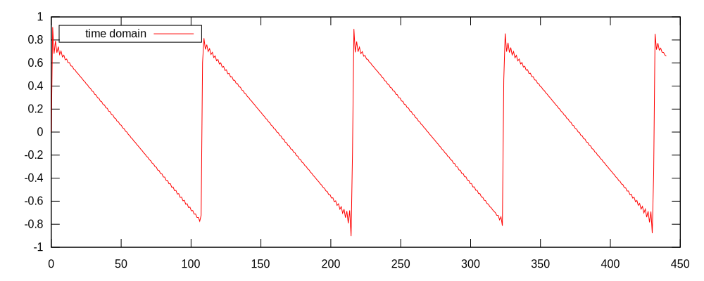

# fft-plot-example
An example of an FFT plotter in Rust using criterion_plot and rustfft.

This is an example of how you can use `criterion_plot` and `rustfft` to generate an FFT analysis of a set of samples.

## Running

```
cargo run
```

Output files will be `time.svg` (showing a plot of the actual waveform) and `magnitude.svg` (showing a FFT plot of the samples)

## Example

A band-limited sawtooth generator's output:




And the FFT plot of the samples, showing **no** aliasing:


